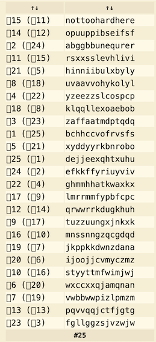

# level00

The first thing I do is... _Nothing..._
I was so lost I try some `ls -la` in the directories where I was the right. But it's not the good way to take.

So I thought what I can do, and I listed all `users` with the following command :
```sh
cut -d: -f1 /etc/passwd
```
- The file `/etc/passwd` stock all users and informations about them (`UID`, `GID`, etc...). The file is formated like that :
```sh
[USER]:[SOME_INFOS]:[MORE_INFOS]:[MORE_MORE_INFOS]
```
- `cut -d: -f1`: it cut the line at the `delim` (with the `-d` flag), here is the char `:` and the `-f1` flag display the first field.

So it display all users : users `level00` to `level14`, `flag00` to `flag14` and other users I can't understand.

**Where is the flag to connect at `flag00` ???**
So I tried to learn how really works the complex command `find` and type this command-line :
```sh
find / -user flag00 2> /dev/null
```
- `find` : powerfull command to search files or content on files from every root.
- `/` : the root for searching -> where `find` start to search, here the root of the machin.
- `-user flag00` : `find` only output the files owned by the user `flag00`
- `2> /dev/null` : redirect the `STDERR` output to `null` for avoid all error message like :
```sh
find: `/some/random/path': Permission denied
```

Here is the output of this command :
```sh
level00@SnowCrash:~$ find / -user flag00 2> /dev/null
/usr/sbin/john
/rofs/usr/sbin/john
level00@SnowCrash:~$
```
I display their contents, which are otherwise exactly the same :
```sh
level00@SnowCrash:~$ cat /usr/sbin/john
cdiiddwpgswtgt
level00@SnowCrash:~$
```
_Mmmh... What's this ? Is this a coded message or something ? Or even the password for the user `flag00` ?_
**No, it's not the correct password.**

I put this string in [this site](https://www.dcode.fr/identification-chiffrement) for identify for a potential encryption and nothing conclusive.
So I tried the Ceasar Cipher and test all possible rotation [here](https://www.dcode.fr/chiffre-cesar)
Here is the output :



The sentence `nottohardhere` looks credible.

I tried this password for the user `flag00` :
```sh
level00@SnowCrash:~$ su flag00
Password:
Don't forget to launch getflag !
flag00@SnowCrash:~$
```

### YEAPAAAH
It's the right password !

- Let's get the flag :
```sh
flag00@SnowCrash:~$ getflag
Check flag.Here is your token : x24ti5gi3x0ol2eh4esiuxias
flag00@SnowCrash:~$
```

- Let's try to connect at `level01` :
```sh
flag00@SnowCrash:~$ su level01
Password:
level01@SnowCrash:~$
```
# level00 complet !


---

## Conclusion
Now for the next levels, I would do this ritual :
- <u>Where I am ?</u> **`pwd`**
- <u>How I am ?</u> **`id`**
- <u>What my files ?</u> **`ls -la`**
- <u>What the files of the flag ?</u> **`find / -user flagXX 2> /dev/null`**
