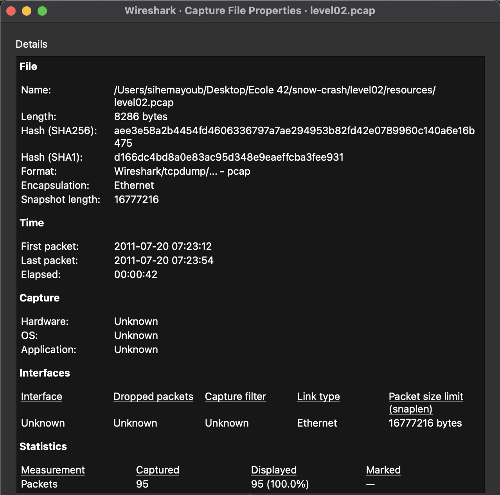
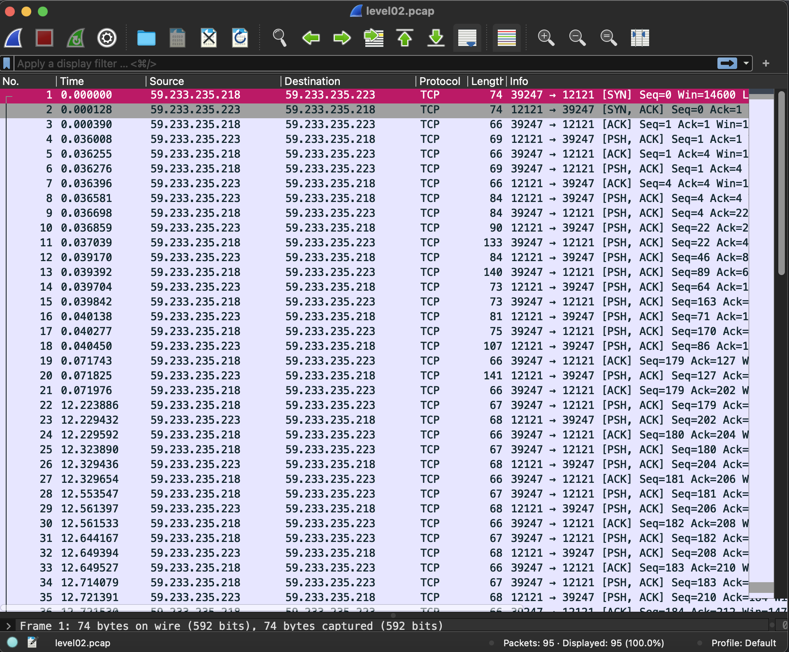
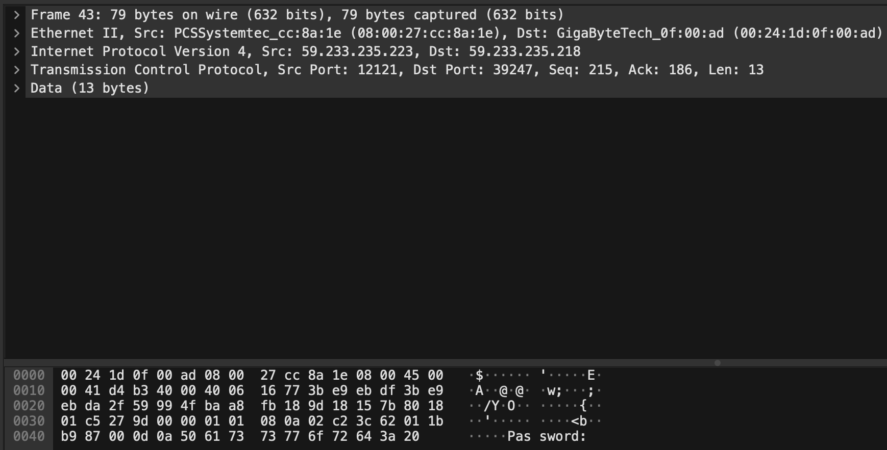
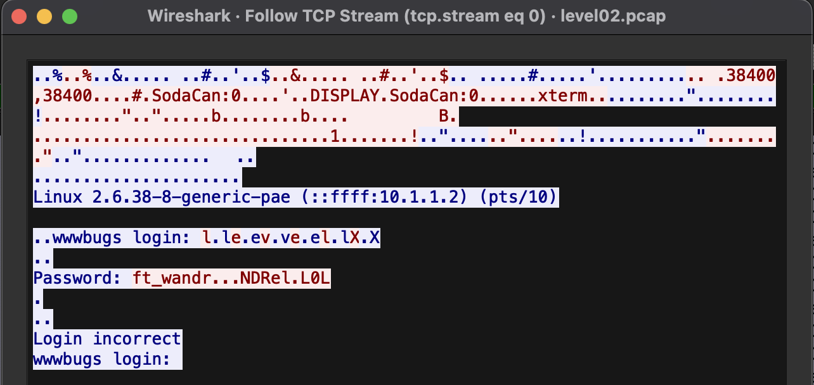
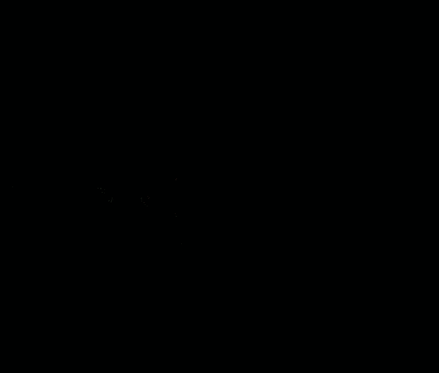

# level02
_The ritual_ :
- `pwd`: `/home/user/level02`
- `id`: `uid=2002(level02) gid=2002(level02) groups=2002(level02),100(users)`
- `ls -la`:
```sh
dr-x------ 1 level02 level02  120 Mar  5  2016 .
d--x--x--x 1 root    users    340 Aug 30  2015 ..
-r-x------ 1 level02 level02  220 Apr  3  2012 .bash_logout
-r-x------ 1 level02 level02 3518 Aug 30  2015 .bashrc
----r--r-- 1 flag02  level02 8302 Aug 30  2015 level02.pcap
-r-x------ 1 level02 level02  675 Apr  3  2012 .profile
```
- `find / -user flag02 2> /dev/null`: nothing

_OH HERE ! A NEW FILE !_
- `cat level02.pcap`
```sh
...
[SOME_UNREADABLE_BINARY_FILE_FOR_HUMANS_OR_SOMETHING]
...
```
But we can anyway read some text like :
```sh
Linux 2.6.38-8-generic-pae (::ffff:10.1.1.2) (pts/10)

wwwbugs login: @f&NV.B'̊$E4��@@J<;���;��ߙO/Y�t���
Login incorrect
wwwbugs login: df&N�%
```

After some research, the extention `.pcap` is associated with the software called [Wireshark](https://www.wireshark.org/). We need this software to open and read the file.
- Wireshark is a **network protocol analyzer** : with Wireshark we can see all exchanges between a client and a server in details.
- And this file with the extension `.pcap` is create with Wireshark : it capture a frame or a momentum of all exchenges beetween the clients and the server of a network and save all that in a file -> **here, the file `level02.pcap` is more exactly a moment when clients and a server communicates in a network**. 42 secondes of excenges has been captured here :


_Okay, now what we can see in these exchanges ?_
This is what Wireshark display when we open the file `level02.pcap` :


Each numbers representes an exchanges with some packets.

_Let's see what all they contained..._
- Verifying 1 by 1 all packets we found this :


_"Password" ?_
```sh
level02@SnowCrash:~$ su flag02
Password:
su: Authentication failure
level02@SnowCrash:~$
```
_Okay it's not that easy_

- When we open an exchange, Wireshark display a unique packet how was exchange, some infos (IP, destination, etc...) and nothing else.
- BUT we can **follow the TCP stream**, doing that display, in order, the all communication between both endpoints and there session, some other informations can be hided with that.
- For simple, all packets we can see here are Lego pieces, if we **follow the TCP stream**, Wireshark assembles all lego pieces for seeing what it look like.
- Let's follow the TCP stream of the "Password" packet :

_"ft_wandrNDRelL0L" ? What is these dots ?_

- Okay let's try it with the dots :
```sh
SnowCrash:~$ su flag02
Password:
su: Authentication failure
level02@SnowCrash:~$
```
- Without the dots ? :
```sh
SnowCrash:~$ su flag02
Password:
su: Authentication failure
level02@SnowCrash:~$
```
_I don't unerstand ??? Let's try another sowing method instead of `ASCII`. Mmmh... `C Array` !_
- Wireshark can show data as other tha `ASCII`, Here what we can see with `C Array` :
```sh
...[USELESS_INFO]...
char peer0_13[] = { /* Packet 45 */
0x66 };
char peer0_14[] = { /* Packet 47 */
0x74 };
char peer0_15[] = { /* Packet 49 */
0x5f };
char peer0_16[] = { /* Packet 51 */
0x77 };
char peer0_17[] = { /* Packet 53 */
0x61 };
char peer0_18[] = { /* Packet 55 */
0x6e };
char peer0_19[] = { /* Packet 57 */
0x64 };
char peer0_20[] = { /* Packet 59 */
0x72 };
char peer0_21[] = { /* Packet 61 */
0x7f };
char peer0_22[] = { /* Packet 63 */
0x7f };
char peer0_23[] = { /* Packet 65 */
0x7f };
char peer0_24[] = { /* Packet 67 */
0x4e };
char peer0_25[] = { /* Packet 69 */
0x44 };
char peer0_26[] = { /* Packet 71 */
0x52 };
char peer0_27[] = { /* Packet 73 */
0x65 };
char peer0_28[] = { /* Packet 75 */
0x6c };
char peer0_29[] = { /* Packet 77 */
0x7f };
char peer0_30[] = { /* Packet 79 */
0x4c };
char peer0_31[] = { /* Packet 81 */
0x30 };
char peer0_32[] = { /* Packet 83 */
0x4c };
char peer0_33[] = { /* Packet 85 */
0x0d };
...[USELESS_INFO]...
```
- With that, we have a better view of the password ! All these `char` of this `array` is the password. If we are attentive, the dots are non-printable characteres : `0x7f` represent the `Del` key, the others are printable char and form `ft_wandrNDRelL0L`.
_The password is "ft_wandrNDRelL0L" but with these non-printable characters ? How can I copy that ?_
- Let's change the showing method to `UTF-8`. It' display exactly `ft_wandrNDRelL0L` but with the invisibles non-printable characters, let's copypast this (`ft_wandrNDRelL0L`) :
```sh
level02@SnowCrash:~$ su flag02
Password:
Don't forget to launch getflag !
flag02@SnowCrash:~$
```
### YEAPAAAAAH
This one was deceitful !
- Let's get the flag :
```sh
flag02@SnowCrash:~$ getflag
Check flag.Here is your token : kooda2puivaav1idi4f57q8iq
flag02@SnowCrash:~$
```
- Let's go to the `level03` :
```sh
flag02@SnowCrash:~$ su level03
Password:
level03@SnowCrash:~$
```
# level02 complet !
