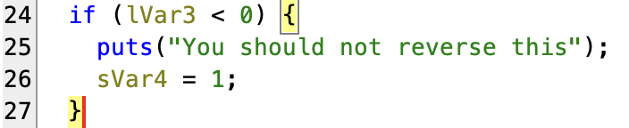

# level09
_The ritual_ :
- `pwd`: `/home/user/level09`
- `id`: `uid=2009(level09) gid=2009(level09) groups=2009(level09),100(users)`
- `ls -la`:
total 24
dr-x------ 1 level09 level09  140 Mar  5  2016 .
d--x--x--x 1 root    users    340 Aug 30  2015 ..
-r-x------ 1 level09 level09  220 Apr  3  2012 .bash_logout
-r-x------ 1 level09 level09 3518 Aug 30  2015 .bashrc
-rwsr-sr-x 1 flag09  level09 7640 Mar  5  2016 level09
-r-x------ 1 level09 level09  675 Apr  3  2012 .profile
----r--r-- 1 flag09  level09   26 Mar  5  2016 token
- `find / -user flag09 2> /dev/null`: nothing

```sh
level09@SnowCrash:~$ ./level09
You need to provied only one arg.
level09@SnowCrash:~$
```

_Okay_

```sh
level09@SnowCrash:~$ ./level09 aaaaaa
abcdef
level09@SnowCrash:~$
```
- It take each char and incremant the value by there index in the string character.

_And what's in `token` ?_

```sh
level09@SnowCrash:~$ cat token
f4kmm6p|=�p�n��DB�Du{��
level09@SnowCrash:~$
```

_Very weird..._

# _OKAY DECOMPILE THIS_



_Wow that's a manace ?_

- The program is pretty long and complicated, I don't want to go through all of it. I will just try to understand the main logic.

This is what I understood :
- The program takes a string as an argument.
- It checks if the string is empty or not.
- Return the string but with `ROT + index` for each character in the `ASCII` table.

# MY THEORY

- The string in `token` is the result of the program with the flag or password for `flag09` user, we need to reverse the process to get the password.

# _Let's reverse it_

- I will write a python script to reverse the process **BUT** in python2 because the VM only has python2 and not python3:

1) `ord(output[i])`: Gets the `Unicode` code of the character at index `i` in output.
2) `chr((ord(output[i]) - i) % 0x110000)`: Gets the character from the `Unicode` code by substracting the index `i` and mod 0x110000.
3) `unichr(...)`: Converts the result to a Unicode character.
4) `sys.stdout.write(...)`: Writes the `Unicode` character to standard output (the screen).

- I discover a thing, I can `chmod` in my `home` I never tested that before, I never paid attention on it each time I execute `ls -la`.

```sh
level09@SnowCrash:~$ chmod 777 .
level09@SnowCrash:~$ nano reverse.py
level09@SnowCrash:~$ python reverse.py token
f3iji1ju5yuevaus41q1afiuq

level09@SnowCrash:~$
```

# _The password of `flag09` ?_

```sh
level09@SnowCrash:~$ su flag09
Password:
Don't forget to launch getflag !
flag09@SnowCrash:~$
```

- Let's get the flag :

```sh
flag09@SnowCrash:~$ getflag
Check flag.Here is your token : s5cAJpM8ev6XHw998pRWG728z
flag09@SnowCrash:~$
```

- Let's go to the `level10` :

```sh
flag09@SnowCrash:~$ su level10
Password:
level10@SnowCrash:~$
```

# level09 complet !

